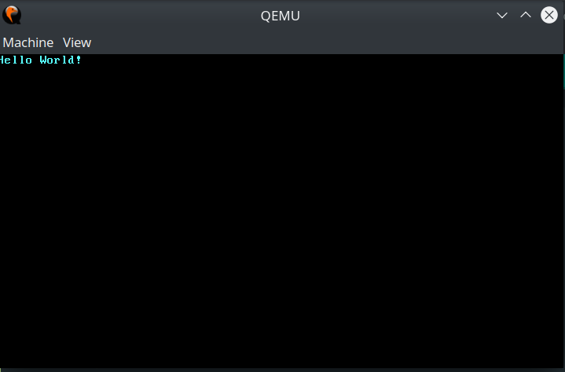

<div align="center">

  
  <h1>TaijiOS</h1>
  
  <p>
    TaijiOS is a hobby operating system written from scratch in Rust for learning systems programming and OSdev.
  </p>
  
  
<!-- Badges -->
<!--
<p>
  <a href="https://github.com/cedrickchee/tiny-os/graphs/contributors">
    
  </a>
  <a href="">
    
  </a>
  <a href="https://github.com/cedrickchee/tiny-os/network/members">
    
  </a>
  <a href="https://github.com/cedrickchee/tiny-os/stargazers">
    
  </a>
  <a href="https://github.com/cedrickchee/tiny-os/issues/">
    
  </a>
  <a href="https://github.com/cedrickchee/tiny-os/blob/master/LICENSE">
    
  </a>
</p>
   
<h4>
    <a href="https://github.com/cedrickchee/tiny-os/">View Demo</a>
  <span> · </span>
    <a href="https://github.com/cedrickchee/tiny-os">Documentation</a>
  <span> · </span>
    <a href="https://github.com/cedrickchee/tiny-os/issues/">Report Bug</a>
  <span> · </span>
    <a href="https://github.com/cedrickchee/tiny-os/issues/">Request Feature</a>
  </h4>
-->
</div>

<br />

<!-- Table of Contents -->
# Table of Contents

- [About the Project](#about-the-project)
  * [Demo](#demo)
  * [Status](#status)
- [Building](#building)
- [Creating a Bootimage](#creating-a-bootimage)
- [Running](#running)
- [Testing](#testing)
- [TODO](#todo)
- [Readings](#readings)
- [Acknowledgements](#acknowledgements)
- [License](#license)

## About the Project

This project implements a [microkernel](microkernel). It's a minimal 64-bit OS
kernel for x86 architecture.

Currently, the kernel boots without crashing and can print something to the
screen (as shown in the below screenshot). Keyboard input is working.

[microkernel]: https://en.wikipedia.org/wiki/Microkernel

### Demo

https://user-images.githubusercontent.com/145605/204237803-46bd5d8d-eadd-438a-b9f2-5af92c6ccad5.mp4

<!--
<div align="center">
  
</div>
-->

### Status

This repository contains my **Work-In-Progress (WIP)** code. Things are still
unstable. "Here be dragons".

**About Multitasking**

Cooperative multitasking is working. I'm implementing preemptive multitasking.

## About the Code

The code for each feature lives in a separate git tag. This makes it possible to
see the intermediate state after each feature.

The latest code is available in the "main" branch.

You can find the tag for each feature by following the link in the feature list
below.

You can check out a tag in a subdirectory using git:

```sh
# make sure that the tag exists locally by doing
$ git fetch --tags

# check out the tag by running
$ git checkout tags/09-paging-implementation
```

### Features

A side-effect of this project is that you can follow the tags for each features
in the following order to see how the kernel evolved:

1. [A Rust executable that does not link the stdlib](https://github.com/cedrickchee/taijios/releases/tag/01-freestanding-rust-binary)
2. [A minimal Rust kernel](https://github.com/cedrickchee/taijios/releases/tag/02-minimal-rust-kernel)
3. [Print text to the screen in VGA text buffer](https://github.com/cedrickchee/taijios/releases/tag/03-vga-text-buffer)
4. [Unit and integration testing](https://github.com/cedrickchee/taijios/releases/tag/04-testing)
5. [Interrupt: CPU exceptions](https://github.com/cedrickchee/taijios/releases/tag/05-cpu-exceptions)
6. [Interrupt: Double fault handler](https://github.com/cedrickchee/taijios/releases/tag/06-double-faults)
7. [Interrupt: Hardware, timer interrupts, keyboard input](https://github.com/cedrickchee/taijios/releases/tag/07-hardware-interrupts)
8. [Memory: Concept of paging](https://github.com/cedrickchee/taijios/releases/tag/08-paging-introduction)
9. [Memory: Paging implementation](https://github.com/cedrickchee/taijios/releases/tag/09-paging-implementation)
10. [Memory: Dynamic memory, implement basic support for heap allocations](https://github.com/cedrickchee/taijios/releases/tag/10-heap-allocation)
11. [Memory: Implement heap allocators from scratch](https://github.com/cedrickchee/taijios/releases/tag/11-allocator-designs)
12. [Cooperative multitasking: Task, create a simple executor](https://github.com/cedrickchee/taijios/releases/tag/12-multitasking-async-await)

## Building

**Install Rust nightly**

This project requires a nightly version of Rust because it uses some unstable
features. At least nightly _2020-07-15_ is required for building. You might need
to run `rustup update nightly --force` to update to the latest nightly even if
some components such as `rustfmt` are missing it.


**The [`build-std` feature][cargo-build-std] of Cargo**

Building the kernel for our new target will fail if we don't use the feature. To
use the feature, we need to create a [Cargo configuration][cargo-config] file at
`.cargo/config.toml` with the following content:

```toml
...

[unstable]
build-std = ["core", "compiler_builtins"]
```

[cargo-build-std]: https://doc.rust-lang.org/nightly/cargo/reference/unstable.html#build-std
[cargo-config]: https://doc.rust-lang.org/cargo/reference/config.html


**Memory-Related Intrinsics**

The Rust compiler assumes that a certain set of built-in functions is available
for all systems. Most of these functions are provided by the `compiler_builtins`
crate that we just recompiled. However, there are some memory-related functions
in that crate that are not enabled by default because they are normally provided
by the C library on the system. These functions include `memset`, `memcpy`, and
`memcmp`.

Since we can’t link to the C library of the operating system, we need an
alternative way to provide these functions to the compiler.

Fortunately, the `compiler_builtins` crate already contains implementations for
all the needed functions, they are just disabled by default to not collide with
the implementations from the C library. We can enable them by setting cargo’s
[build-std-features]
(https://doc.rust-lang.org/nightly/cargo/reference/unstable.html#build-std-features)
flag to `["compiler-builtins-mem"]`. This can be configured in the `unstable`
table in the `.cargo/config.toml` file.

```toml
...

[unstable]
build-std-features = ["compiler-builtins-mem"]
build-std = ["core", "compiler_builtins"]
```

(Support for the `compiler-builtins-mem` feature was only [added very recently]
(https://github.com/rust-lang/rust/pull/77284), so you need at least Rust
nightly 2020-09-30 for it.)

With this change, our kernel has valid implementations for all compiler-required
functions, so it will continue to compile even if our code gets more complex.

**Set a Default Target**

To avoid passing the `--target` parameter on every invocation of `cargo build`,
we can override the default target. To do this, we add the following to our
cargo configuration file at `.cargo/config.toml`:

```toml
...

[build]
target = "x86_64-tiny_os.json"
```

This tells cargo to use our `x86_64-tiny_os.json` target when no explicit
`--target` argument is passed. This means that we can now build our kernel with
a simple `cargo build`.


**We are now able to build our kernel for a bare metal target!**

To build this project, run:

```sh
$ cargo build
  Downloaded getopts v0.2.21
  ...
  Downloaded libc v0.2.126
  Downloaded compiler_builtins v0.1.73
  Downloaded cc v1.0.69
  ...
  Downloaded 14 crates (2.1 MB) in 1.36s
   Compiling core v0.0.0 (~/.rustup/toolchains/nightly-x86_64-unknown-linux-gnu/lib/rustlib/src/rust/library/core)
   Compiling compiler_builtins v0.1.73
   Compiling rustc-std-workspace-core v1.99.0 (~/.rustup/toolchains/nightly-x86_64-unknown-linux-gnu/lib/rustlib/src/rust/library/rustc-std-workspace-core)
   Compiling tiny-os v0.1.0 (~/repo/github/tiny-os)
    Finished dev [unoptimized + debuginfo] target(s) in 11.90s
```

<details>
  <summary>If you encountered linker errors</summary>
The linker is a program that combines the generated code into an executable.
Since the executable format differs between Linux, Windows, and macOS, each
system has its own linker that throws a different error. The fundamental cause
of the errors is the same: the default configuration of the linker assumes that
our program depends on the C runtime, which it does not.

To solve the errors, we need to tell the linker that it should not include the C
runtime. We can do this either by passing a certain set of arguments to the
linker or by building for a bare metal target.

**Building for a Bare Metal Target**

By default Rust tries to build an executable that is able to run in your current
system environment. For example, if you’re using Windows on `x86_64`, Rust tries
to build a `.exe` Windows executable that uses `x86_64` instructions. This
environment is called your “host” system.

To describe different environments, Rust uses a string called [target
triple](https://clang.llvm.org/docs/CrossCompilation.html#target-triple).

By compiling for our host triple, the Rust compiler and the linker assume that
there is an underlying operating system such as Linux or Windows that use the C
runtime by default, which causes the linker errors. So to avoid the linker
errors, we can compile for a different environment with no underlying operating
system.

An example for such a bare metal environment is the `thumbv7em-none-eabihf` target
triple, which describes an embedded ARM system. The details are not important,
all that matters is that the target triple has no underlying operating system,
which is indicated by the `none` in the target triple. To be able to compile for
this target, we need to add it in rustup:

```sh
$ rustup target add thumbv7em-none-eabihf
info: downloading component 'rust-std' for 'thumbv7em-none-eabihf'
info: installing component 'rust-std' for 'thumbv7em-none-eabihf'
```

This downloads a copy of the standard (and core) library for the system. Now we
can build our freestanding executable for this target:

```sh
$ cargo build --target thumbv7em-none-eabihf
   Compiling tiny-os v0.1.0 (/home/neo/dev/work/repo/github/tiny-os)
    Finished dev [unoptimized + debuginfo] target(s) in 0.78s
```

By passing a `--target` argument we cross compile our executable for a bare
metal target system. Since the target system has no operating system, the
linker does not try to link the C runtime and our build succeeds without any
linker errors.

This is the approach that we will use for building our OS kernel. Instead of
`thumbv7em-none-eabihf`, we will use a [custom target](https://doc.rust-lang.org/rustc/targets/custom.html) that describes a `x86_64`
bare metal environment. The details will be explained in the next post.
</details>

## Creating a Bootimage

To turn our compiled kernel into a bootable disk image, we need to link it with
a bootloader. The bootloader is responsible for initializing the CPU and loading
our kernel.

To create a bootable disk image from the compiled kernel, you need to install
the [`bootimage`] tool:

[`bootimage`]: https://github.com/rust-osdev/bootimage

```
$ cargo install bootimage
```

For running bootimage and building the bootloader, you need to have the
`llvm-tools-preview` rustup component installed. You can install it by executing
`rustup component add llvm-tools-preview`.

After installing, you can create the bootable disk image by running:

```
$ cargo bootimage
Building kernel
   Compiling bootloader v0.9.22
   Compiling tiny-os v0.1.0 (/home/neo/dev/work/repo/github/tiny-os)
    Finished dev [unoptimized + debuginfo] target(s) in 0.49s
Building bootloader
   ...
   Compiling bootloader v0.9.22 (~/.cargo/registry/src/github.com-1ecc6299db9ec823/bootloader-0.9.22)
   Compiling compiler_builtins v0.1.73
   ...
   Compiling x86_64 v0.14.7
    Finished release [optimized + debuginfo] target(s) in 2.90s
Created bootimage for `tiny-os` at `~/repo/github/tiny-os/target/x86_64-tiny_os/debug/bootimage-tiny-os.bin`
```

This creates a bootable disk image in the `target/x86_64-tiny_os/debug`
directory.
## Running

You can run the disk image in [QEMU] through:

[QEMU]: https://www.qemu.org/

```
$ cargo run
    Finished dev [unoptimized + debuginfo] target(s) in 0.03s
     Running `bootimage runner target/x86_64-tiny_os/debug/tiny-os`
Building bootloader
    Finished release [optimized + debuginfo] target(s) in 0.06s
Running: `qemu-system-x86_64 -drive format=raw,file=target/x86_64-tiny_os/debug/bootimage-tiny-os.bin`
```

[QEMU] and the [`bootimage`] tool need to be installed for this.

You can also write the image to an USB stick for booting it on a real machine.
On Linux, the command for this is:

```
$ dd if=target/x86_64-tiny_os/debug/bootimage-tiny-os.bin of=/dev/sdX && sync
```

Where `sdX` is the device name of your USB stick. **Be careful** to choose the
correct device name, because everything on that device is overwritten.

## Testing

To run the unit and integration tests, execute `cargo test`.

## TODO

Now:

- [ ] Preemptive multitasking
  - [ ] Threads (a common form of preemptive multitasking)
  - [ ] Utilize multiple CPU cores
  - [ ] Processes and multiprocesses
- [ ] Heap allocators - Bump allocator (now). Explore arena allocator. (there is
  no "best" allocator design that fits all cases)
- We are able to interact with our kernel and have some fundamental building
  blocks for creating a:
  - [ ] Tiny shell
  - [ ] Simple programs
- [ ] Improve I/O
- [ ] File system

Future:
- [ ] Re-implement boot loader from scratch
- [ ] ARM port
- [ ] RISC-V port

## Readings

I planned to read these articles or blog posts and do some literature review
along the way.

- The Global Descriptor Table (GDT)

  GDT is a relict that was used for memory segmentation before paging became the
  de facto standard. It is still needed in 64-bit mode for various things such
  as kernel/user mode configuration or TSS loading.

  For more information about segmentation check out the equally named chapter of
  the free [OS "Three Easy Pieces" (OSTEP) book](http://pages.cs.wisc.edu/%7Eremzi/OSTEP/).

- The x86-interrupt calling convention

  A powerful abstraction that hides almost all of the messy details of the
  exception handling process.

- The breakpoint exception is commonly used in debuggers: When the user sets a
  breakpoint, the debugger overwrites the corresponding instruction with the
  int3 instruction so that the CPU throws the breakpoint exception when it
  reaches that line.

  For more details, see the ["How debuggers work"](https://eli.thegreenplace.net/2011/01/27/how-debuggers-work-part-2-breakpoints)

- Configuring the Timer

  The hardware timer that we use is called the _Programmable Interval Timer_
  or PIT for short. The OSDev wiki has an extensive article about the
  [configuring the PIT](https://wiki.osdev.org/Programmable_Interval_Timer).

- Memory management

  Important topics to read again: Segmentation, Virtual Memory, Fragmentation,
  Paging, Hidden Fragmentation, Page Tables, and Multilevel Page Tables.

  The fragmentation problem is one of the reasons that segmentation is no
  longer used by most systems. In fact, segmentation is not even supported in
  64-bit mode on x86 anymore. Instead _paging_ is used, which completely
  avoids the fragmentation problem.

- Fixed-size block allocator

  Allocators used in OS kernels are typically highly optimized to the specific
  workload of the kernel.

  For more info, check out ["The Linux kernel memory allocators"](https://argp.github.io/2012/01/03/linux-kernel-heap-exploitation/).

## Acknowledgements

Many work have indirectly contributed to this project. Here are some of the work
that I would like to thank them:

<details>
  <summary>Blog Posts, Articles, Presentations, and Papers</summary>

- [Is It Time to Rewrite the Operating System in Rust?](https://www.infoq.com/presentations/os-rust/) - A presentation  (by Bryan Cantrill at QCon
- [CS-537: Introduction to Operating Systems](https://pages.cs.wisc.edu/~remzi/Classes/537/Spring2018) class by Remzi H. (UW-Madison)
- [Learning to build an Operating System in Rust via CS140e](https://downey.io/blog/cs140e-writing-an-operating-system-in-rust/)
- Alex Light's [Reenix: Implementing a Unix-Like Operating System in Rust](https://scialex.github.io/reenix.pdf) paper (Brown University, Dept of ComSci)
- [BlogOS](https://os.phil-opp.com)
- [Bare Metal Rust: Building kernels in Rust](http://www.randomhacks.net/bare-metal-rust/)
- [Rust-OS Kernel - To userspace and back!](https://nfil.dev/kernel/rust/coding/rust-kernel-to-userspace-and-back/)
  - I refer to this post for my preemptive multitasking implementation:
    - Context switching, syscall
    - Writing a simple, round-robin task scheduler so that we can run multiple processes at once
- [The development of OxidizedOS](https://ryan-jacobs1.github.io/)
  - Threads and context switching
  - Writing a cooperative schedule
- [Getting to know Rust by building an OS](https://github.com/rbgrouleff/daft)
- [Redox](https://www.redox-os.org/) - a Unix-like OS written in Rust, aiming to
  bring the innovations of Rust to a modern microkernel and full set of apps.
- [RISC-V OS using Rust](https://osblog.stephenmarz.com/)

</details>

<details>
  <summary>Hobby OSes</summary>

- [MOROS](https://github.com/vinc/moros) - Obscure Rust Operating System.
- [r3](https://github.com/Narasimha1997/r3) - A tiny multi-tasking hobby operating system kernel written in Rust.
- [litchi-rs](https://github.com/BugenZhao/litchi-rs) - An x86-64 kernel with ~100% Rust (originally) in a week.
- [A toy OS in Rust](https://github.com/emk/toyos-rs)
- [juner_os](https://github.com/zzhgithub/juner_os) - This project combines elements from both blog_os and mal.
  - [rCore](https://github.com/rcore-os/rCore) - Rust version of THU uCore OS Plus.
- [LibertyOS's THANKYOU](https://github.com/LibertyOS-Development/kernel/blob/main/THANKYOU.md)
- [QuiltOS](https://github.com/QuiltOS/QuiltOS) - A language-based OS to run Rust on bare metal. A fork of RustOS.

</details>

<details>
  <summary>Uncategorized</summary>

- [OSDev Wiki](https://wiki.osdev.org/Main_Page)
  - [Xv6](https://wiki.osdev.org/Xv6)
    - [Xv6 Homepage](https://pdos.csail.mit.edu/6.828/2018/xv6.html) - Xv6, a simple Unix-like teaching OS
      - [Xv6 code](https://github.com/mit-pdos/xv6-public) - Kernel hacking in Xv6
    - [Commentary book on Xv6](https://pdos.csail.mit.edu/6.828/2018/xv6/book-rev10.pdf) in PDF, it is brief (less than 100 pages) and an easy reading
  - [Brendan's Multi-tasking Tutorial](https://wiki.osdev.org/Brendan%27s_Multi-tasking_Tutorial)
- [VSCode, GDB, and Debugging an OS](https://austinhanson.com/vscode-gdb-and-debugging-an-os/)
- [High Assurance Rust: Developing Secure and Robust Software](https://highassurance.rs/chp3/modules.html) - The module system

</details>

## License

This project is licensed under [MIT license](./LICENSE).
